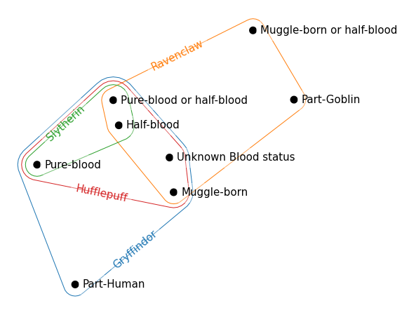

HyperNetX
==========
[](https://github.com/pnnl/HyperNetX/actions/workflows/ci.yml)
[](https://github.com/psf/black)
[](https://github.com/PyCQA/pylint)


The HyperNetX library provides classes and methods for the analysis
and visualization of complex network data modeled as hypergraphs.
The library generalizes traditional graph metrics.

HypernetX was developed by the Pacific Northwest National Laboratory for the
Hypernets project as part of its High Performance Data Analytics (HPDA) program.
PNNL is operated by Battelle Memorial Institute under Contract DE-ACO5-76RL01830.

* Principal Developer and Designer: Brenda Praggastis
* Development Team: Madelyn Shapiro, Mark Bonicillo
* Visualization: Dustin Arendt, Ji Young Yun
* Principal Investigator: Cliff Joslyn
* Program Manager: Brian Kritzstein
* Principal Contributors (Design, Theory, Code): Sinan Aksoy, Dustin Arendt, Mark Bonicillo, Helen Jenne, Cliff Joslyn, Nicholas Landry, Audun Myers, Christopher Potvin, Brenda Praggastis, Emilie Purvine, Greg Roek, Madelyn Shapiro, Mirah Shi, Francois Theberge, Ji Young Yun

The code in this repository is intended to support researchers modeling data
as hypergraphs. We have a growing community of users and contributors.
Documentation is available at: https://pnnl.github.io/HyperNetX

For questions and comments contact the developers directly at: hypernetx@pnnl.gov

New Features in Version 2.0
===========================

HNX 2.0 now accepts metadata as core attributes of the edges and nodes of a
hypergraph. While the library continues to accept lists, dictionaries and
dataframes as basic inputs for hypergraph constructions, both cell
properties and edge and node properties can now be easily added for
retrieval as object attributes.

The core library has been rebuilt to take advantage of the flexibility and speed of Pandas Dataframes.
Dataframes offer the ability to store and easily access hypergraph metadata. Metadata can be used for filtering objects, and characterize their
distributions by their attributes.

**Version 2.0 is not backwards compatible. Objects constructed using version
1.x can be imported from their incidence dictionaries.**

What's New
----------
1. The Hypergraph constructor now accepts nested dictionaries with incidence cell properties, pandas.DataFrames, and 2-column Numpy arrays.
1. Additional constructors accept incidence matrices and incidence dataframes.
1. Hypergraph constructors accept cell, edge, and node metadata.
1. Metadata available as attributes on the cells, edges, and nodes.
1. User-defined cell weights and default weights available to incidence matrix.
1. Meta data persists with restrictions and removals.
1. Meta data persists onto s-linegraphs as node attributes of Networkx graphs.
1. New hnxwidget available using  `pip install hnxwidget`.


What's Changed
--------------
1. The `static` and `dynamic` distinctions no longer exist. All hypergraphs use the same underlying data structure, supported by Pandas dataFrames. All hypergraphs maintain a `state_dict` to avoid repeating computations.
1. Methods for adding nodes and hyperedges are currently not supported.
1. The `nwhy` optimizations are no longer supported.
1. Entity and EntitySet classes are being moved to the background. The Hypergraph constructor does not accept either.


Tutorials
=========

Google Colab
------------


<a href="https://colab.research.google.com/github/pnnl/HyperNetX/blob/master/tutorials/Tutorial%201%20-%20HNX%20Basics.ipynb" target="_blank">
  
    <span >Tutorial 1 - HNX Basics</span>
</a>
<br>

<a href="https://colab.research.google.com/github/pnnl/HyperNetX/blob/master/tutorials/Tutorial%202%20-%20Visualization%20Methods.ipynb" target="_blank">
  
    <span >Tutorial 2 - Visualization Methods</span>
</a>
<br>

<a href="https://colab.research.google.com/github/pnnl/HyperNetX/blob/master/tutorials/Tutorial%203%20-%20LesMis%20Case%20Study.ipynb" target="_blank">
  
    <span >Tutorial 3 - LesMis Case Study</span>
</a>
<br>

<a href="https://colab.research.google.com/github/pnnl/HyperNetX/blob/master/tutorials/Tutorial%204%20-%20LesMis%20Visualizations-BookTour.ipynb" target="_blank">
  
    <span >Tutorial 4 - LesMis Visualizations-Book Tour</span>
</a>
<br>

<a href="https://colab.research.google.com/github/pnnl/HyperNetX/blob/master/tutorials/Tutorial%205%20-%20s-Centrality.ipynb" target="_blank">
  
    <span >Tutorial 5 - s-Centrality</span>
</a>
<br>

<a href="https://colab.research.google.com/github/pnnl/HyperNetX/blob/master/tutorials/Tutorial%206%20-%20Homology%20mod%202%20for%20TriLoop%20Example.ipynb" target="_blank">
  
    <span >Tutorial 6 - Homology mod2 for TriLoop Example</span>
</a>
<br>


Jupyter Notebooks
-----------------

Additional tutorials that can be run as Jupyter Notebooks can be found in the 'tutorials-jupyter' folder.

Installation
====================

The recommended installation method for most users is to create a virtual environment and install HyperNetX from PyPi.

HyperNetX may be cloned or forked from [Github](https://github.com/pnnl/HyperNetX).

Prerequisites
-------------
HyperNetX officially supports Python 3.8, 3.9, 3.10 and 3.11.

Create a virtual environment
----------------------------

### Using venv


```shell
python -m venv venv-hnx
source venv-hnx/bin/activate
```


### Using Anaconda


```shell
conda create -n venv-hnx python=3.11 -y
conda activate venv-hnx
```


### Using virtualenv


```shell
virtualenv env-hnx
source env-hnx/bin/activate
```


### For Windows Users

On both Windows PowerShell or Command Prompt, you can use the following command to activate your virtual environment:

```shell
.\env-hnx\Scripts\activate
```

To deactivate your environment, use:

```shell
.\env-hnx\Scripts\deactivate
```

Installing HyperNetX
====================

Regardless of how you install HyperNetX, ensure that your environment is activated and that you are running Python >=3.8.


Installing from PyPi
--------------------

```shell
pip install hypernetx
```

Installing from Source
----------------------

Ensure that you have [git](https://git-scm.com/book/en/v2/Getting-Started-Installing-Git) installed.

```shell
git clone https://github.com/pnnl/HyperNetX.git
cd HyperNetX
pip install .
```

Post-Installation Actions
=========================

Running Tests
-------------

```shell
python -m pytest
```

Development
===========

Install an editable version
---------------------------

```
pip install -e .
```

Install an editable version with access to jupyter notebooks
------------------------------------------------------------

```shell
pip install -e .'[all]'
```

Install support for testing
-----------------------------

> ℹ️ **NOTE:** This project has a pytest configuration file named 'pytest.ini'. By default, pytest will use those configuration settings to run tests.

```shell
pip install .'[testing]'

# run tests
python -m pytest

# run tests and show coverage report
python -m pytest --cov=hypernetx

# Generate an HTML code coverage report and view it on a browser
coverage html
open htmlcov/index.html
```

Install support for tutorials
-----------------------------

``` shell
pip install .'[tutorials]'
```

Install support for documentation
---------------------------------

```shell
pip install .'[documentation]'
cd docs

## This will generate the documentation in /docs/build/
## Open them in your browser with docs/build/html/index.html
make html
```


Code Quality
------------
HyperNetX uses a number of tools to maintain code quality:

* Pylint
* Black

Before using these tools, ensure that you install Pylint in your environment:

```shell
pip install .'[linting]'
```


### Pylint

[Pylint](https://pylint.pycqa.org/en/latest/index.html) is a static code analyzer for Python-based projects. From the [Pylint docs](https://pylint.pycqa.org/en/latest/index.html#what-is-pylint):

> Pylint analyses your code without actually running it. It checks for errors, enforces a coding standard, looks for code smells, and can make suggestions about how the code could be refactored. Pylint can infer actual values from your code using its internal code representation (astroid). If your code is import logging as argparse, Pylint will know that argparse.error(...) is in fact a logging call and not an argparse call.


We have a Pylint configuration file, `.pylintrc`, located at the root of this project.
To run Pylint and view the results of Pylint, run the following command:

```shell
pylint hypernetx --rcfile=.pylintrc
```

You can also run Pylint on the command line to generate a report on the quality of the codebase and save it to a file named "pylint-results.txt":

```shell
pylint hypernetx --output=pylint-results.txt
```

For more information on configuration, see https://pylint.pycqa.org/en/latest/user_guide/configuration/index.html

### Black

[Black](https://black.readthedocs.io/en/stable/) is a PEP 8 compliant formatter for Python-based project. This tool is highly opinionated about how Python should be formatted and will automagically reformat your code.


```shell
black hypernetx
```

Documentation
===============

Build and view documentation locally
---------------------------

```
cd docs
make html
open docs/build/html/index.html
```

Editing documentation
----------------------
NOTE: make sure you install the required dependencies using: `make docs-deps`

When editing documentation, you can auto-rebuild the documentation locally so that you can view your document changes
live on the browser without having to rebuild every time you have a change.

```
cd docs
make livehtml
```

This make script will run in the foreground on your terminal. You should see the following:

```shell
The HTML pages are in docs/html.
[I 230324 09:50:48 server:335] Serving on http://127.0.0.1:8000
[I 230324 09:50:48 handlers:62] Start watching changes
[I 230324 09:50:48 handlers:64] Start detecting changes
[I 230324 09:50:54 handlers:135] Browser Connected: http://127.0.0.1:8000/install.html
[I 230324 09:51:02 handlers:135] Browser Connected: http://127.0.0.1:8000/
```

Click on `http://127.0.0.1:8000/install.html` to open the docs on your browser. Since this will auto-rebuild, every time
you change a document file, it will automatically render on your browser, allowing you to verify your document changes.


Continuous Integration
======================

This project runs Continuous Integration (CI) using GitHub Actions. Normally, CI runs
on pull requests, pushes to certain branches, and other events.

Maintainers of the GitHub repository can manually trigger CI using [GitHub CLI](https://cli.github.com/). See instructions below on how to manually trigger CI on GitHub Actions:

```commandline
# login to Github
gh auth login --with-token <  ~/.ssh/tokens/<path to my personal access token>

# Trigger CI
gh workflow run ci.yml --repo pnnl/HyperNetX --ref <name of branch that you want CI to run on> --field triggeredBy="<Your name>"

# Get the status of the workflow
gh run list --workflow=ci.yml --repo pnnl/HyperNetX
```


Versioning
----------

This project uses [`commitizen`](https://github.com/commitizen-tools/commitizen) to manage versioning.
The files where "version" will be updated are listed in the '.cz.toml' file. To create a new version and the associated tag,
run the following commands:

```shell
# Install commitizen tool to environment
make version-deps

# Updates version; values for '--increment' can be MAJOR, MINOR, or PATCH
# Autocreates a tag and commit for the updated version
cz bump  --increment MAJOR  --dry-run
cz bump  --increment MAJOR
```

Notice
======
This material was prepared as an account of work sponsored by an agency of the United States Government.  Neither the United States Government nor the United States Department of Energy, nor Battelle, nor any of their employees, nor any jurisdiction or organization that has cooperated in the development of these materials, makes any warranty, express or implied, or assumes any legal liability or responsibility for the accuracy, completeness, or usefulness or any information, apparatus, product, software, or process disclosed, or represents that its use would not infringe privately owned rights.
Reference herein to any specific commercial product, process, or service by trade name, trademark, manufacturer, or otherwise does not necessarily constitute or imply its endorsement, recommendation, or favoring by the United States Government or any agency thereof, or Battelle Memorial Institute. The views and opinions of authors expressed herein do not necessarily state or reflect those of the United States Government or any agency thereof.

   <div align=center>
   <pre style="align-text:center;font-size:10pt">
   PACIFIC NORTHWEST NATIONAL LABORATORY
   operated by
   BATTELLE
   for the
   UNITED STATES DEPARTMENT OF ENERGY
   under Contract DE-AC05-76RL01830
   </pre>
   </div>


License
=======

Released under the 3-Clause BSD license (see License.rst)
