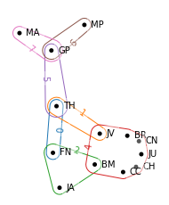

Installing HyperNetX
====================

The HyperNetX library provides classes and methods for the analysis 
and visualization of complex network data. HyperNetX uses data structures 
designed to represent set systems containing nested data and/or multi-way 
relationships. The library generalizes traditional graph metrics to hypergraphs.

HypernetX was developed by the Pacific Northwest National Laboratory for the 
Hypernets project as part of its High Performance Data Analytics (HPDA) program. 
PNNL is operated by Battelle Memorial Institute under Contract DE-AC05-76RL01830.

* Principle Developer and Designer: Brenda Praggastis
* Graphics Developer and Designer: Dustin Arendt
* Principle Investigator: Emilie Purvine
* Program Manager: Cliff Joslyn, Mark Raugas
* Mathematics, methods, and algorithms: Sinan Aksoy, Dustin Arendt, Cliff Joslyn, Brenda Praggastis, and Emilie Purvine
* Software support: Kyle Monson

The current version is preliminary. We are actively testing and would be grateful 
for comments and suggestions.  Expect changes in both class names and methods as 
many of the requirements demanded of the library are worked out. 

For questions and comments you may contact the developers directly at:   
	hypernetx@pnnl.gov

To install in an Anaconda environment
-------------------------------------

	>>> conda create -n <env name> python=3.6
	>>> source activate <env name> 

Mac Users: If you wish to build the documentation you will need
the conda version of matplotlib:
	
	>>> conda install matplotlib

To install in a virtualenv environment
--------------------------------------

	>>> virtualenv --python=<path to python 3.6 executable> <path to env name>

This will create a virtual environment in the specified location using
the specified python executable. For example:

	>>> virtualenv --python=C:\Anaconda3\python.exe hnx

This will create a virtual environment in .\hnx using the python
that comes with Anaconda3.

	>>> <path to env name>\Scripts\activate<file extension>

If you are running in Windows PowerShell use <file extension>=.ps1

If you are running in Windows Command Prompt use <file extension>=.bat

Otherwise use <file extension>=NULL (no file extension).

Once activated continue to follow the installation instructions below.

Install using Pip
-----------------

For a minimal installation:

	>>> pip install hypernetx

For an editable installation with access to jupyter notebooks: 

    >>> pip install [-e] .

To install with the tutorials: 

	>>> pip install -e .['tutorials']

To install with the documentation: 
	
	>>> pip install -e .['documentation']
	>>> sphinx-build -b html docs/source docs/build 
	## This will generate the documentation in /docs/build
	## Open them in your browser with /docs/build/index.html

To install and test using pytest:

	>>> pip install -e .['testing']
	>>> pytest

To install the whole shabang:

	>>> pip install -e .['all']

License
-------

Released under the 3-Clause BSD license (see :ref:`license`)

