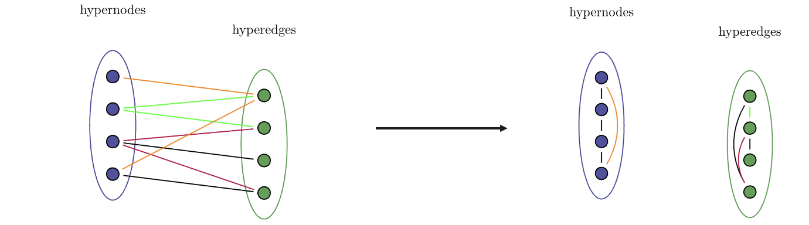
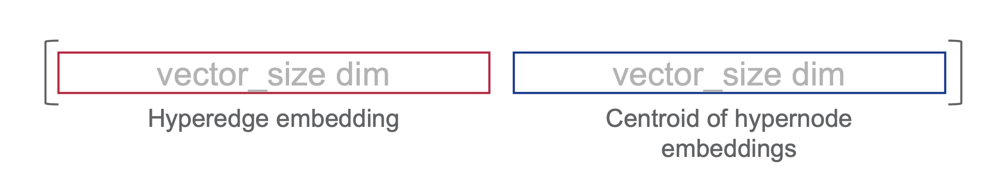
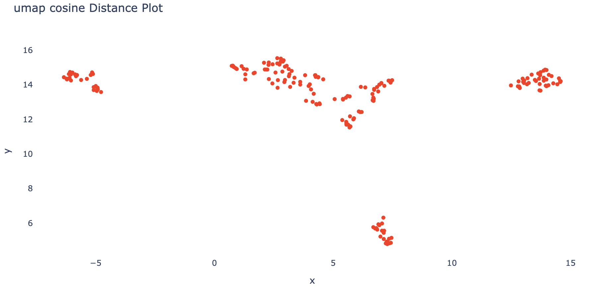

Hypergraph Vectorization
===================================

Introduction
------------
This module implements methods for vectorizing nodes and edges in a hypergraph. It utilizes an implementation of the Node2Vec [1] algorithm to generalize the method to the context of hypergraphs.

The Node2Vec algorithm is applied independently on the line graphs associated to the nodes/edges of the hypergraph to create separate embedding spaces to account for the difference in meaning between the values of the nodes and edges. 



For a complete hyperedge embedding, we concatenate the Node2Vec embedding of the hyperedge with the centroid of the Node2Vec embeddings of all nodes contained in the hyperedge. 



Alternatively, when performing a hypernode embedding, we concatenate the Node2Vec embedding of the hypernode with the centroid of the Node2Vec embeddings of all edges that contain the hypernode.

Usage Example
-------------
Below is an example of how to use the HEdge2Vec algorithms module.

```python
from hypernetx.algorithms.hedge2vec import Hedge2Vec

# Example hypergraph data
hypergraph = ... # Assume this is a connected hypergraph

# Choose whether or vectorize 'nodes' or 'edges'
vectorization = 'edges'

# Instantiate the Hedge2Vec object
h2v = Hedge2Vec(vectorization=vectorization)

# Fit the model on the hypergraph to run learn the hypergraph embeddings
h2v.fit(hypergraph)

# Create a dictionary keyed by node/edge names with values embedding vector
embedding_dict = dict(zip(h2v._train_names, h2v._train_matrix))
print(embedding_dict)

# Apply dimensionality reduction and plot results
emb_2d = h2v.dim_red_embeddings(dim_red='umap')
h2v.plot_embeddings(emb_2d)



References
-------------
[1] node2vec: Scalable Feature Learning for Networks (https://arxiv.org/pdf/1607.00653.pdf)
