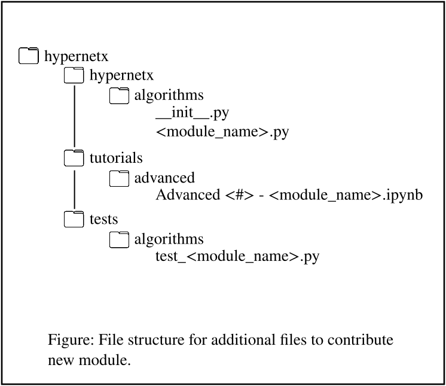

HyperNetX Contributor Guidelines
****************************************************

We welcome contributions to HyperNetX! 
This document outlines the process for contributing to various aspects of the codebase.
We currently only provide guidelines for new modules, but we are not opposed to other forms of contribution to the HyperNetX library.

Contributing New Modules
============================

We happily accept the contribution of new modules or methods to the HyperNetX library. We will do our best to keep modules functioning with new release but may ask contributors to update code when possible. 
Contributions can be slow, but the closer the pull request is to our guidelines the faster this process will be. 
The required new files for any new module are listed below and an example file structure of the additional files is shown in the figure below. 

* Python file: Create a new Python file named **<module_name>.py** under the folder **hypernetx/hypernetx/algorithms/.**. This file will contain the core functionalities of your module. All methods need to have docstrings in the new module.

* Jupyter Notebook: Create a Jupyter notebook under in the folder **hypernetx/tutorials/advanced/.** that demonstrates usage examples of your module. This notebook should be named **Advanced <module number> - <module_name>.ipynb**. Please look at the current advanced module number and choose an appropriate number.

* Test file: Write unit tests for your module in a file named **test_<module_name>.py** under the tests folder located at **hypernetx/tests/algorithms/.**. These tests should ensure the correctness and functionality of your code.

* Documentation: Write an rst file named **<module_name>.rst** under the algorithms documentation folder located at **hypernetx/docs/source/algorithms/.**. This documentations should focus on the mathematics or theory behind your module with citations to relevant papers and documents. Additionally it should provide code snippets demonstrating usage that parallel the tutorial.

Step-by-Step Process
~~~~~~~~~~~~~~~~~~~~

#. Branch Creation: Create a new branch from the main development branch for your contribution. This allows you to isolate your changes and work independently. Use a descriptive branch name that reflects the module you're adding (e.g., add_<module_name>).

#. Code Implementation: Implement the functionalities of your module in a new **<module_name>.py** file located in **hypernetx/hypernetx/algorithms/.**. Please validate that your code dependencies are not in conflict with the core HNX dependencies. Any additional dependencies should be documented thoroughly including in the notebook creation step.

#. Documentation: Write docstrings for your code to explain the purpose and usage of functions and classes. Additionally provide an overview description of the module in the python file. For an example of the correct docstring format please see the module **hypernetx/hypernetx/algorithms/s_centrality_measures.py**.

#. Jupyter Notebook Creation: Create a Jupyter notebook named **Advanced <module number> - <module_name>.ipynb** under advanced tutorials folder **hypernetx/tutorials/advanced/.**. This notebook should showcase how to use your module and demonstrate its capabilities with thorough documentation. Additionally, in the notebook and any other documentation please provide clear documentation on any new dependencies outside of core HNX that are required.

#. Testing: Write unit tests in the test_<module_name>.py file to ensure your module functions as expected. This should be located in the algorithm tests folder. In the top hypernetx directory you can use the makefile and the command ``make test`` to validate everything is passing. Please see other tests and follow a similar format.

# Read the Docs: Include your rst file in the algorithms folder of the source docs overviewing the theory/mathematics of the new module with example code. See other rst files as examples of formatting.

#. __init__.py Update: Update the __init__.py file in the **hypernetx/hypernetx/algorithms/** folder to import your new module. Please follow the style of importing used by the other modules.

#. Commit and Push: Commit your changes with clear and concise commit messages describing each modification. Push your commits to your branch on the remote repository.

#. Pull Request: Create a pull request from your branch to the main development branch. This will initiate a code review process.

Additional Notes
~~~~~~~~~~~~~~~~~~~~

* Make sure your code adheres to PEP 8 style guidelines for Python code.
* Please add comments to your code to explain complex logic or non-obvious functionalities.
* During the review process, address any feedback or suggestions from reviewers promptly.
* Any dependencies in core HNX should not be changed for new modules. Also please list any additionally dependencies thoroughly.

By following these guidelines, you can ensure a smooth and efficient contribution process for adding new modules to HyperNetX. We appreciate your contributions to the project!