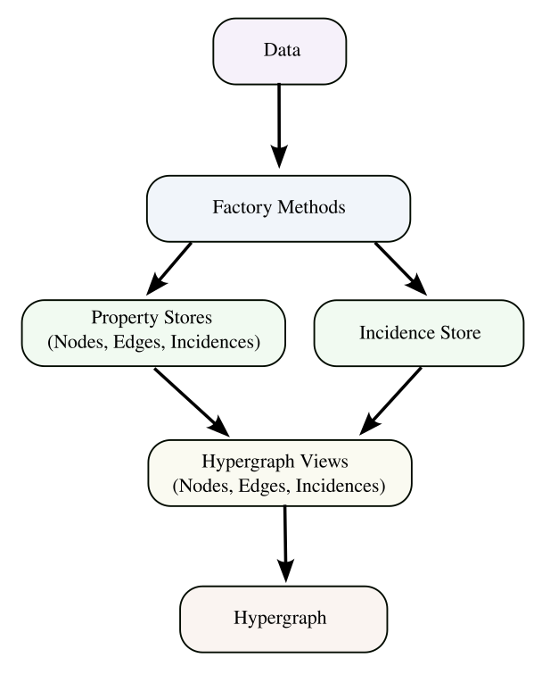

.. _glossary:

===================
HNX Data Structures
===================

   
   Code structure for HNX.

The HNX library centers around the idea of a :term:`hypergraph`.  
There are many definitions of a *hypergraph*. In HNX a hypergraph
is a tuple of three sets, :math:`H =  (V, E, \mathcal{I})`. 

- :math:`V`, a set of *nodes* (aka hypernodes, vertices), distinguished by unique identifiers
- :math:`E` a set of *edges* (aka hyperedges), distinguished by  unique identifiers
- :math:`\mathcal{I}`, a set of *incidences*, which form a subset of :math:`E \times V`, distinguished by the pairing of unique identifiers of edges in :math:`E` and nodes in :math:`V`

The incidences :math:`\mathcal{I}` can be described by a Boolean function, :math:`\mathcal{I}_B : E \times V \rightarrow \{0, 1\}`, indicating whether or not a pair is included in the hypergraph.

In HNX we instantiate :math:`H =  (V, E, \mathcal{I})` using three *hypergraph views.* We can visualize this through a high 
level diagram of our current code structure shown in Fig. 1. Here we begin with data (e.g., data frame, dictionary, 
list of lists, etc.) that is digested via the appropriate factory method to construct property stores for nodes, 
edges, and incidences as well as an incidence store that captures the hypergraph structure. 
These four objects are then used to create three hypergraph views that the hypergraph object 
uses to access and analyze the hypergraph structure and attributes.

=====================
Glossary of HNX terms
=====================

**Note: For all definitions below, assume** :math:`H =  (V, E, \mathcal{I})` **is a
hypergraph.**

.. glossary::
	:sorted:

	
	PropertyStore
		Class in property_store.py. Each of the basic sets in a hypergraph, (Nodes, Edges, Incidences), have metadata stored in a
		PropertyStore. By storing the data and metadata in a single place, updates and references have a single source of
		truth.

	hypergraph
		A hypergraph is a tuple of three sets, :math:`H =  (V, E, \mathcal{I})`. 

		- :math:`V`, a set of *nodes* (aka hypernodes, vertices), distinguished by unique identifiers
		- :math:`E` a set of *edges* (aka hyperedges), distinguished by  unique identifiers
		- :math:`\mathcal{I}`, a set of *incidences*, which form a subset of :math:`E \times V`, distinguished by the pairing of unique identifiers of edges in :math:`E` and nodes in :math:`V`
		
	multihypergraph
		HNX hypergraphs may be multihypergraphs. A multihypergraph is a hypergraph that allows distinct edges to contain the same set of *elements* and distinct nodes to belong to the same set of edges (aka *memberships*). When collapsing a hypergraph,
		edges incident with the same set of nodes or nodes incident with the same set of edges are collapsed to single objects.

	IncidenceStore
		Class in incidence_store.py holding the set of ordered pairs of Edges and Nodes belonging to the hypergraph. The :term:`elements` and 
		:term:`memberships` are inferred from the :term:`incidences` held in the IncidenceStore.

	HypergraphView
		Class in hyp_view.py tying the properties of hypergraph objects held in the :term:`PropertyStore` class, which holds metadata, with their ids 
		held in the :term:`IncidenceStore` class, which holds the Hypergraph relationships.
		The PropertyStores are unaware of the IncidenceStore and vice versa.

	elements
		The elements of an edge is the set of nodes incident to the edge in the Hypergraph.

	memberships   
		The memberships of a node is the set of edges incident to the node in the Hypergraph.

	incidences
		The ordered pairs in :math:`\mathcal{I} \subset E \times V`, which define the relationships in the hypergraph.
		The incidences :math:`\mathcal{I}` of a hypergraph provide the minimal amount of data required to instantiate the hypergraph. 
		The Edges :math:`E` and Nodes :math:`V` of a Hypergraph can be inferred from the pairs :math:`(e,v)` in the Incidences.
			
		Each incidence uniquely identifies a single edge and node.
		Each incidence has metadata assigned to it. Incidences
		in a hypergraph are assigned a weight either by default or specified by a user.
		If :math:`(e,v) \in \mathcal{I}` then :math:`e` *contains* :math:`v`, :math:`v` is an
		:term:`element <elements>` of :math:`e`, and :math:`v` has :term:`membership <memberships>` in :math:`e`.
		
	incidence matrix
		A rectangular matrix constructed from a hypergraph, :math:`H =  (V, E, \mathcal{I})`. The rows of the matrix are indexed by :math:`V`. 
		The columns of the matrix are indexed by :math:`E`. An entry in the matrix at
		position :math:`(v,e)` for some :math:`v \in V`  and :math:`e \in E` is nonzero if and only if :math:`(e,v) \in I`. 	
		A *weighted* incidence matrix uses the incidence weight associated with :math:`(e,v)` for the nonzero entry. An *unweighted* incidence
		matrix has the integer :math:`1` in all nonzero entries.
		

	edges
	hyperedges
		A set of objects distinguished by unique identifiers (uids). Each edge has 
		metadata associated with it. Edges are assigned a weight either by default or
		specified by the user. Edges contain nodes. Nodes are :term:`elements` of edges.

	nodes
	vertices
	hypernodes
		A set of objects distinguished by unique identifiers (uids). Each node has 
		metadata associated with it. Nodes are assigned a weight either by default or
		specified by the user. Nodes belong to edges. Nodes have :term:`memberships` in edges.

	subhypergraph
		A subhypergraph of a hypergraph, :math:`H =  (V, E, \mathcal{I})`, is a hypergraph, :math:`H' =  (V', E', \mathcal{I'})` such that :math:`(e',v') \in \mathcal{I'}` if and only if :math:`e' \in E' \subset E`, :math:`v' \in V' \subset V` and :math:`(e,v) \in \mathcal{I}`.

	degree
		Given a hypergraph :math:`H =  (V, E, \mathcal{I})`, the degree of a node in :math:`V` is the number of edges in :math:`E` to which the node is incident.
		See also: :term:`s-degree`		

	dual
		The dual of a hypergraph exchanges the roles of the edges and nodes in the hypergraph.
		For a hypergraph :math:`H =  (V, E, \mathcal{I})` the dual is
		:math:`H_D = (E, V, \mathcal{I}^T)` where the ordered pairs in :math:`\mathcal{I}^T` are the transposes of the ordered pairs in :math:`\mathcal{I}`.  The :term:`incidence matrix` of :math:`H_D` is the transpose of the incidence matrix of :math:`H`.

	toplex
		A toplex in a hypergraph, :math:`H =  (V, E, \mathcal{I})`, is an edge :math:`e \in E` whose set of elements is not properly contained in any other edge in :math:`E`. That is, if :math:`f \in E` and the elements of :math:`e` are all elements of :math:`f` then the elements of :math:`f` are all elements of :math:`e`. 

	simple hypergraph
		A hypergraph for which no edge is completely contained in another.

	s-adjacent
		For a hypergraph, :math:`H =  (V, E, \mathcal{I})`, and positive integer s,
		two nodes in :math:`V` are s-adjacent if there are at least s edges in :math:`E`, which contain both of them.

	s-edge-adjacent
		For a hypergraph, :math:`H =  (V, E, \mathcal{I})`, and positive integer s,
		two edges in :math:`E` are s-edge-adjacent if
		they there are at least s nodes in :math:`V` belonging to both of them.
		Another way of saying this is two edges are s-edge-adjacent if 
		they are s-adjacent in the dual of :math:`H`.

	s-adjacency matrix
		For a positive integer s, a square matrix for a hypergraph, :math:`H =  (V, E, \mathcal{I})`, indexed by :math:`V` such that an
		entry :math:`(v_1,v_2)` is nonzero if only if :math:`v_1, v_2 \in V` are s-adjacent. An s-adjacency matrix can be weighted or unweighted, in which case all entries are 0's and 1's.

	s-edge-adjacency matrix
		An s-edge-adjacency matrix is the s-adjacency matrix for the dual
		of :math:`H`.

	s-auxiliary matrix
	s-edge-auxiliary matrix
		For a hypergraph, :math:`H =  (V, E, \mathcal{I})`, and positive integer s, the submatrix of the :term:`s-adjacency matrix` or the :term:`s-edge-adjacency matrix` obtained by removing all 0-rows and 0-columns.

	s-node-walk
		For a hypergraph, :math:`H =  (V, E, \mathcal{I})`, and positive integer s, a sequence of nodes in :math:`V` such that each successive pair of nodes are s-adjacent. The length of the
		s-node-walk is the number of adjacent pairs in the sequence.

	s-edge-walk
		For a hypergraph, :math:`H =  (V, E, \mathcal{I})`, and positive integer s, a sequence of edges in :math:`E` such that each successive pair of edges are s-edge-adjacent. The length of the
		s-edge-walk is the number of adjacent pairs in the sequence.

	s-walk
		Either an s-node-walk or an s-edge-walk. The length of the
		s-walk is the number of adjacent pairs in the sequence.

	s-connected component
	s-node-connected component
	s-edge-connected component
		For a hypergraph, :math:`H =  (V, E, \mathcal{I})`, and positive integer s, an s-connected component is a :term:`subhypergraph` induced by a subset of :math:`V` with the property that there exists an s-walk between every pair of nodes in this subset. 
		An s-connected component is the maximal such subset in the sense that it is not properly contained in any other subset satisfying this property.

		An s-node-connected component is an s-connected component. An 
		s-edge-connected component is an s-connected component of the dual
		of :math:`H`.

	s-connected
	s-node-connected
	s-edge-connected
		A hypergraph is s-connected if it has one s-connected component.
		Similarly for s-node-connected and s-edge-connected.

	s-degree
		For a hypergraph, :math:`H =  (V, E, \mathcal{I})`, and positive integer s, the s-degree of a node, :math:`v \in V` is the number of edges in :math:`E` of size at least s to which :math:`v` belongs. See also: :term:`degree`

	s-distance
		For a hypergraph, :math:`H =  (V, E, \mathcal{I})`, and positive integer s, the s-distances between two nodes in :math:`V` is the length of the shortest :term:`s-node-walk` between them. 
		If no s-node-walk between the pair of nodes exists, the s-distance between them is infinite. 
		
	s-edge-distance
		The s-edge-distance
		between two edges in :math:`E` is the length of the shortest :term:`s-edge-walk` between them. If no s-edge-walk between the pair of edges exists, then s-distance between them is infinite.

	s-diameter
		For a hypergraph, :math:`H =  (V, E, \mathcal{I})`, and positive integer s, the s-diameter is the maximum s-distance over all pairs of nodes in :math:`V`.

	s-edge
		For a hypergraph, :math:`H =  (V, E, \mathcal{I})`, and positive integer s, an s-edge is any edge :math:`e \in E` of size at least s, where the
		size of :math:`e` equals the number of nodes in :math:`V` belonging to :math:`e`.

	s-linegraph
		For a hypergraph, :math:`H =  (V, E, \mathcal{I})`, and positive integer s, an s-linegraph :math:`G` is a graph representing
		the node to node or edge to edge connections defined by the :term:`s-adjacency matrices<s-adjacency matrix>`.

		The node s-linegraph, :math:`G_V` is a graph on the set :math:`V`. Two nodes in :math:`V` are incident in :math:`G_V` if they are :term:`s-adjacent`.

		The edge s-linegraph, :math:`G_E` is a graph on the set :math:`E`. Two edges in :math:`E` are incident in :math:`G_E` if they are :term:`s-edge-adjacent`.

