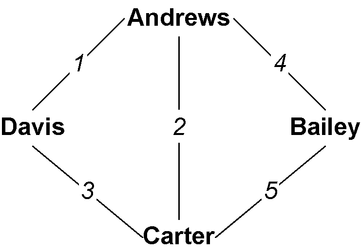
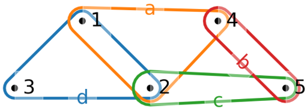
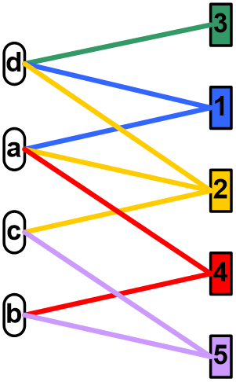
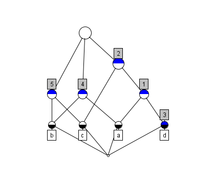
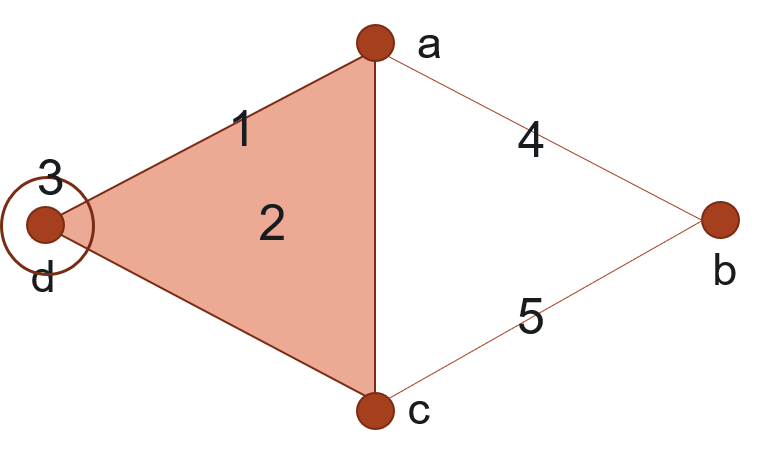

.. _hypergraph101:

===============================================
A Gentle Introduction to Hypergraph Mathematics
===============================================

Here we gently introduce some of the basic concepts in hypergraph
modeling. We note that in order to maintain this “gentleness”, we will
be mostly avoiding the very important and legitimate issues in the
proper mathematical foundations of hypergraphs and closely related
structures, which can be very complicated. Rather we will be focusing on
only the most common cases used in most real modeling, and call a graph
or hypergraph **gentle** when they are loopless, simple, finite,
connected, and lacking empty hyperedges, isolated vertices, labels,
weights, or attributes. Additionally, the deep connections between
hypergraphs and other critical mathematical objects like partial orders,
finite topologies, and topological complexes will also be treated
elsewhere. When it comes up, below we will sometimes refer to the added
complexities which would attend if we weren’t being so “gentle”. In
general the reader is referred to [1,2] for a less gentle and more
comprehensive treatment.

Graphs and Hypergraphs
======================

Network science is based on the concept of a **graph**
:math:`G=\langle V,E\rangle` as a system of connections between
entities. :math:`V` is a (typically finite) set of elements, nodes, or
objects, which we formally call **“vertices”**, and :math:`E` is a set
of pairs of vertices. Given that, then for two vertices
:math:`u,v \in V`, an **edge** is a set :math:`e=\{u,v\}` in :math:`E`,
indicating that there is a connection between :math:`u` and :math:`v`.
It is then common to represent :math:`G` as either a Boolean **adjacency
matrix** :math:`A_{n \times n}` where :math:`n=|V|`, where an
:math:`i,j` entry in :math:`A` is 1 if :math:`v_i,v_j` are connected in
:math:`G`; or as an **incidence matrix** :math:`I_{n \times m}`, where
now also :math:`m=|E|`, and an :math:`i,j` entry in :math:`I` is now 1
if the vertex :math:`v_i` is in edge :math:`e_j`.

.. _f1:

    An example graph, where the numbers are edge IDs.

.. _t1:
.. list-table:: Adjacency matrix :math:`A` of a graph.
   :header-rows: 1
   :align: center

   * -
     - Andrews
     - Bailey
     - Carter
     - Davis
   * - Andrews
     - 0
     - 1
     - 1
     - 1
   * - Bailey
     - 1
     - 0
     - 1
     - 0
   * - Carter
     - 1
     - 1
     - 0
     - 1
   * - Davis
     - 1
     - 0
     - 1
     - 1

.. _t2:
.. list-table:: Incidence matrix :math:`I` of a graph.
   :header-rows: 1
   :align: center

   * -
     - 1
     - 2
     - 3
     - 4
     - 5
   * - Andrews
     - 1
     - 1
     - 0
     - 1
     - 0
   * - Bailey
     - 0
     - 0
     - 0
     - 1
     - 1
   * - Carter
     - 0
     - 1
     - 1
     - 0
     - 1
   * - Davis
     - 1
     - 0
     - 1
     - 0
     - 0

.. _label3:
.. figure:: images/biblio_hg.png
    :class: with-border
    :width: 400
    :align: center

    An example hypergraph, where similarly now the hyperedges are shown with numeric IDs.

.. _t3:
.. list-table:: Incidence matrix I of a hypergraph.
   :header-rows: 1
   :align: center

   * -
     - 1
     - 2
     - 3
     - 4
     - 5
   * - Andrews
     - 1
     - 1
     - 0
     - 1
     - 0
   * - Bailey
     - 0
     - 0
     - 0
     - 1
     - 1
   * - Carter
     - 0
     - 1
     - 0
     - 0
     - 1
   * - Davis
     - 1
     - 1
     - 1
     - 0
     - 0

Notice that in the incidence matrix :math:`I` of a gentle graph
:math:`G`, it is necessarily the case that every column must have
precisely two 1 entries, reflecting that every edge connects exactly two
vertices. The move to a **hypergraph** :math:`H=\langle V,E\rangle`
relaxes this requirement, in that now a **hyperedge** (although we will
still say edge when clear from context) :math:`e \in E` is a subset
:math:`e = \{ v_1, v_2, \ldots, v_k\} \subseteq V` of vertices of
arbitrary size. We call :math:`e` a :math:`k`-edge when :math:`|e|=k`.
Note that thereby a 2-edge is a graph edge, while both a singleton
:math:`e=\{v\}` and a 3-edge :math:`e=\{v_1,v_2,v_3\}`, 4-edge
:math:`e=\{v_1,v_2,v_3,v_4\}`, etc., are all hypergraph edges. In this
way, if every edge in a hypergraph :math:`H` happens to be a 2-edge,
then :math:`H` is a graph. We call such a hypergraph **2-uniform**.

Our incidence matrix :math:`I` is now very much like that for a graph,
but the requirement that each column have exactly two 1 entries is
relaxed: the column for edge :math:`e` with size :math:`k` will have
:math:`k` 1’s. Thus :math:`I` is now a general Boolean matrix (although
with some restrictions when :math:`H` is gentle).

Notice also that in the examples we’re showing in the figures, the graph
is closely related to the hypergraph. In fact, this particular graph is
the **2-section** or **underlying graph** of the hypergraph. It is the
graph :math:`G` recorded when only the pairwise connections in the
hypergraph :math:`H` are recognized. Note that while the 2-section is
always determined by the hypergraph, and is frequently used as a
simplified representation, it almost never has enough information to be
able to recover the hypergraph from it.

Important Things About Hypergraphs
==================================

While all graphs :math:`G` are (2-uniform) hypergraphs :math:`H`, since
they’re very special cases, general hypergraphs have some important
properties which really stand out in distinction, especially to those
already conversant with graphs. The following issues are critical for
hypergraphs, but “disappear” when considering the special case of
2-uniform hypergraphs which are graphs.

All Hypergraphs Come in Dual Pairs
----------------------------------

If our incidence matrix :math:`I` is a general :math:`n \times m`
Boolean matrix, then its transpose :math:`I^T` is an :math:`m \times n`
Boolean matrix. In fact, :math:`I^T` is also the incidence matrix of a
different hypergraph called the **dual** hypergraph :math:`H^*` of
:math:`H`. In the dual :math:`H^*`, it’s just that vertices and edges
are swapped: we now have :math:`H^* = \langle E, V \rangle` where it’s
:math:`E` that is a set of vertices, and the now edges
:math:`v \in V, v \subseteq E` are subsets of those vertices.

.. _f3:

    The dual hypergraph :math:`H^*`.

Just like the “primal” hypergraph :math:`H` has a 2-section, so does the
dual. This is called the **line graph**, and it is an important
structure which records all of the incident hyperedges. Line graphs are
also used extensively in graph theory.

Note that it follows that since every graph :math:`G` is a (2-uniform)
hypergraph :math:`H`, so therefore we can form the dual hypergraph
:math:`G^*` of :math:`G`. If a graph :math:`G` is a 2-uniform
hypergraph, is its dual :math:`G^*` also a 2-uniform hypergraph? In
general, no, only in the case where :math:`G` is a single cycle or a
union of cycles would that be true. Also note that in order to calculate
the line graph of a graph :math:`G`, one needs to work through its dual
hypergraph :math:`G^*`.

.. _f4:
.. figure:: images/dual2.png
    :class: with-border
    :width: 400
    :align: center

    The line graph of :math:`H`, which is the 2-section of the dual :math:`H^*`.

Edge Intersections Have Size
----------------------------

As we’ve already seen, in a graph all the edges are size 2, whereas in a
hypergarph edges can be arbitrary size :math:`1, 2, \ldots, n`. Our
example shows a singleton, three “graph edge” pairs, and a 2-edge.

In a gentle graph :math:`G` consider two edges
:math:`e = \{ u, v \},f=\{w,z\} \in E` and their intersection
:math:`g = e \cap f`. If :math:`g \neq \emptyset` then :math:`e` and
:math:`f` are non-disjoint, and we call them **incident**. Let
:math:`s(e,f)=|g|` be the size of that intersection. If :math:`G` is
gentle and :math:`e` and :math:`f` are incident, then :math:`s(e,f)=1`,
in that one of :math:`u,v` must be equal to one of :math:`w,z`, and
:math:`g` will be that singleton. But in a hypergraph, the intersection
:math:`g=e \cap f` of two incident edges can be any size
:math:`s(e,f) \in [1,\min(|e|,|f|)]`. This aspect, the size of the
intersection of two incident edges, is critical to understanding
hypergraph structure and properties.

Edges Can Be Nested
-------------------

While in a gentle graph :math:`G` two edges :math:`e` and :math:`f` can
be incident or not, in a hypergraph :math:`H` there’s another case: two
edges :math:`e` and :math:`f` may be **nested** or **included**, in that
:math:`e \subseteq f` or :math:`f \subseteq e`. That’s exactly the
condition above where :math:`s(e,f) = \min(|e|,|f|)`, which is the size
of the edge included within the including edge. In our example, we have
that edge 1 is included in edge 2 is included in edge 3.

Walks Have Length and Width
---------------------------

A **walk** is a sequence
:math:`W = \langle { e_0, e_1, \ldots, e_N } \rangle` of edges where
each pair :math:`e_i,e_{i+1}, 0 \le i \le N-1` in the sequence are
incident. We call :math:`N` the **length** of the walk. Walks are the
*raison d’être* of both graphs and hypergraphs, in that in a graph
:math:`G` a walk :math:`W` establishes the connectivity of all the
:math:`e_i` to each other, and a way to “travel” between the ends
:math:`e_0` and :math:`e_N`. Naturally in a walk for each such pair we
can also measure the size of the intersection
:math:`s_i=s(e_i,e_{i+1}), 0 \le i \le N`. While in a gentle graph
:math:`G`, all the :math:`s_i=1`, as we’ve seen in a hypergraph
:math:`H` all these :math:`s_i` can vary widely. So for any walk
:math:`W` we can not only talk about its length :math:`N`, but also
define its **width** :math:`s(W) = \min_{0 \le i \le N} s_i` as the size
of the smallest such intersection. When a walk :math:`W` has width
:math:`s`, we call it an **:math:`s`-walk**. It follows that all walks
in a graph are 1-walks with width 1. In Fig. `5 <#swalks>`__ we see two
walks in a hypergraph. While both have length 2 (counting edgewise, and
recalling origin zero), the one on the left has width 1, and that on the
right width 3.

.. _f5:
.. figure:: images/swalks.png
    :class: with-border
    :width: 600
    :align: center

    Two hypergraph walks of length 2: (Left) A 1-walk. (Right) A 3-walk.

Towards Less Gentle Things
==========================

We close with just brief mentions of more advanced issues.

:math:`s`-Walks and Hypernetwork Science
----------------------------------------

Network science has become a dominant force in data analytics in recent
years, including a range of methods measuring distance, connectivity,
reachability, centrality, modularity, and related things. Most all of
these concepts generalize to hypergraphs using “:math:`s`-versions” of
them. For example, the :math:`s`-distance between two vertices or
hyperedges is the length of the shortest :math:`s`-walk between them, so
that as :math:`s` goes up, requiring wider connections, the distance
will also tend to grow, so that ultimately perhaps vertices may not be
:math:`s`-reachable at all. See [2] for more details.

Hypergraphs in Mathematics
--------------------------

Hypergraphs are very general objects mathematically, and are deeply
connected to a range of other essential objects and structures mostly in
discrete science.

Most obviously, perhaps, is that there is a one-to-one relationship
between a hypergraph :math:`H = \langle V, E \rangle` and a
corresponding bipartite graph :math:`B=\langle V \sqcup E, I \rangle`.
:math:`B` is a new graph (not a hypergraph) with vertices being both the
vertices and the hyperedges from the hypergraph :math:`H`, and a
connection being a pair :math:`\{ v, e \} \in I` if and only if
:math:`v \in e` in :math:`H`. That you can go the other way to define a
hypergraph :math:`H` for every bipartite graph :math:`G` is evident, but
not all operations carry over unambiguously between hypergraphs and
their bipartite versions.

.. _f6:

    Bipartite graph.

Even more generally, the Boolean incidence matrix :math:`I` of a
hypergraph :math:`H` can be taken as the characteristic matrix of a
binary relation. When :math:`H` is gentle this is somewhat restricted,
but in general we can see that there are one-to-one relations now
between hypergraphs, binary relations, as well as bipartite graphs from
above.

Additionally, we know that every hypergraph implies a hierarchical
structure via the fact that for every pair of incident hyperedges either
one is included in the other, or their intersection is included in both.
This creates a partial order, establishing a further one-to-one mapping
to a variety of lattice structures and dual lattice structures relating
how groups of vertices are included in groups of edges, and vice versa.
Fig. refex shows the **concept lattice** [3], perhaps the most important
of these structures, determined by our example.

.. _f7:

    The concept lattice of the example hypergraph :math:`H`.

Finally, the strength of hypergraphs is their ability to model multi-way
interactions. Similarly, mathematical topology is concerned with how
multi-dimensional objects can be attached to each other, not only in
continuous spaces but also with discrete objects. In fact, a finite
topological space is a special kind of gentle hypergraph closed under
both union and intersection, and there are deep connections between
these structures and the lattices referred to above.

In this context also an **abstract simplicial complex (ASC)** is a kind
of hypergraph where all possible included edges are present. Each
hypergraph determines such an ASC by “closing it down” by subset. ASCs
have a natural topological structure which can reveal hidden structures
measurable by homology, and are used extensively as the workhorse of
topological methods such as persistent homology. In this way hypergraphs
form a perfect bridge from network science to computational topology in
general.

.. _f8:

    A diagram of the ASC implied by our example. Numbers here indicate the actual hyper-edges in the original hypergraph :math:`H`, where now additionally all sub-edges, including singletons, are in the ASC.

Non-Gentle Graphs and Hypergraphs
---------------------------------

Above we described our use of “gentle” graphs and hypergraphs as finite,
loopless, simple, connected, and lacking empty hyperedges, isolated
vertices, labels, weights, or attributes. But at a higher level of
generality we can also have:

Empty Hyperedges:
   If a column of :math:`I` has all zero entries.

Isolated Vertices:
   If a row of :math:`I` has all zero entries.

Multihypergraphs:
   We may choose to allow duplicated hyperedges, resulting in duplicate
   columns in the incidence matrix :math:`I`.

Self-Loops:
   In a graph allowing an edge to connect to itself.

Direction:
   In an edge, where some vertices are recognized as “inputs” which
   point to others recognized as “outputs”.

Order:
   In a hyperedge, where the vertices carry a particular (total) order.
   In a graph, this is equivalent to being directed, but not in a
   hypergraph.

Attributes:
   In general we use graphs and hypergraphs to model data, and thus
   carrying attributes of different types, including weights, labels,
   identifiers, types, strings, or really in principle any data object.
   These attributes could be on vertices (rows of :math:`I`), edges
   (columns of :math:`I`) or what we call “incidences”, related to a
   particular appearnace of a particular vertex in a particular edge
   (cells of :math:`I`).

[1] Joslyn, Cliff A; Aksoy, Sinan; Callahan, Tiffany J; Hunter, LE;
Jefferson, Brett; Praggastis, Brenda; Purvine, Emilie AH; Tripodi,
Ignacio J: (2021) “Hypernetwork Science: From Multidimensional
Networks to Computational Topology”, in: *Unifying Themes in Complex
systems X: Proc. 10th Int. Conf. Complex Systems*, ed. D. Braha et
al., pp. 377-392, Springer,
``https://doi.org/10.1007/978-3-030-67318-5_25``

[2] Aksoy, Sinan G; Joslyn, Cliff A; Marrero, Carlos O; Praggastis, B;
Purvine, Emilie AH: (2020) “Hypernetwork Science via High-Order
Hypergraph Walks”, *EPJ Data Science*, v. **9**:16,
``https://doi.org/10.1140/epjds/s13688-020-00231-0``

[3] Ganter, Bernhard and Wille, Rudolf: (1999) *Formal Concept
Analysis*, Springer-Verlag

