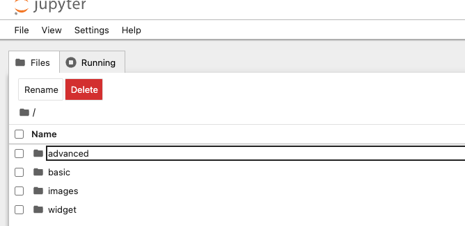

# Overview

These tutorials demonstrate how to use [hnxwidget](https://pypi.org/project/hnxwidget/), an interactive visualization tool
of HyperNetX.

# How to run the tutorials on Jupyter Notebook

Create a virtual environment:

`make venv`

Activate the environment:

`source venv-hnx/bin/activate`

Navigate to the root of this repository. Install the required dependencies in order to run the Jupyter Notebooks:

`make tutorials-deps`

Once the dependencies have been installed, run the notebooks:

`make tutorials`

This command will open up the notebooks on a browser at the following URL: http://localhost:8888/tree

Below is a screenshot of what to expect to see on the browser. Click a folder and open the desired
tutorial on your browser:

